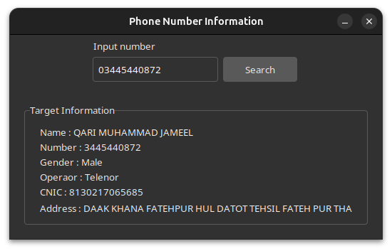

# 📱 Pakistani SIM Details GUI

A Python desktop application built with **Tkinter** that fetches and displays detailed information about Pakistani phone numbers, including name, CNIC, gender, operator, and address.

---

## ✨ Features

- 🔍 **Real-time Lookup**: Search for phone number details instantly
- 📊 **Comprehensive Data**: Retrieves name, CNIC, gender, mobile operator, and address
- 🎨 **Modern UI**: Beautiful Forest Dark/Light themed interface using TTK
- ⚡ **Fast & Lightweight**: Minimal resource usage, quick response time
- 🛡️ **Error Handling**: Graceful error messages for invalid or not-found numbers
- 🌙 **Dark/Light Theme Support**: Toggle between dark and light themes
- 📞 **Operator Detection**: Automatically identifies mobile operator (Telenor, Zong, Jazz)
- 👥 **Gender Identification**: Determines gender based on CNIC last digit

---

## 📸 Screenshots

### Main Interface


---

## 🚀 Quick Start

### Prerequisites

- Python 3.7 or higher
- pip (Python package manager)

### Installation

1. **Clone the repository**
```bash
git clone https://github.com/BilalHaiderID/pak-sim-details-gui.git
cd pak-sim-details-gui
```

2. **Install dependencies**
```bash
pip install -r requirements.txt
```

Required packages:
- `tkinter` (usually comes with Python)
- `requests` (for HTTP requests)
- `beautifulsoup4` (for HTML parsing)

3. **Run the application**
```bash
python main.py
```

---

## 💻 Usage

1. **Launch the application** by running `python main.py`
2. **Enter a Pakistani phone number** in the format: `03400000000` or similar
3. **Click the "Search" button** to fetch the information
4. **View the results** in the "Target Information" section below

### Supported Format
- Pakistani mobile numbers starting with `03XX` format
- Example: `03001234567`, `03005678901`, etc.

---

## 📁 Project Structure

```
pak-sim-details-gui/
├── main.py                 # Main GUI application
├── infomodule.py          # Backend module for data fetching
├── forest-dark.tcl        # Dark theme configuration
├── forest-light.tcl       # Light theme configuration
├── forest-dark/           # Dark theme assets
├── forest-light/          # Light theme assets
├── screenshots/           # Application screenshots
│   └─�� screenshot1.png
└── README.md              # This file
```

---

## 🔧 Technical Details

### Main Components

#### `main.py`
- Tkinter GUI implementation
- User interface with input field and display area
- Event handlers for focus management
- Theme management

#### `infomodule.py`
- `numinfo()` function: Core data fetching logic
- Web scraping using BeautifulSoup
- Parses HTML responses from freshsimdatabases.com
- Extracts relevant information from database tables

### Data Extraction

The application extracts the following information:

| Field | Source | Method |
|-------|--------|--------|
| **Name** | Tax collection field | HTML parsing |
| **Phone Number** | MSISDN field | Table cell extraction |
| **CNIC** | CNIC field | Direct extraction |
| **Gender** | CNIC last digit | Odd = Male, Even = Female |
| **Operator** | Image identifier | Logo recognition in HTML |
| **Address** | Tax deduction field | HTML parsing |

---

## 📋 API Details

### `numinfo(number)` Function

**Parameters:**
- `number` (str): Pakistani phone number in format `03XXXXXXXXX`

**Returns:**
```python
{
    "status": "success" or "error",
    "name": "Person Name",
    "number": "03001234567",
    "gender": "Male" or "Female",
    "operator": "Telenor" or "Zong" or "Jazz",
    "cnic": "XXXXX-XXXXXXX-X",
    "address": "City/Area Name"
}
```

**Error Response:**
```python
{
    "status": "error"
}
```

---

## 🎨 UI Customization

The application uses **Forest Theme** for modern aesthetics. To switch themes:

```python
style.theme_use("forest-dark")  # For dark theme
style.theme_use("forest-light") # For light theme
```

---

## ⚙️ Configuration

### HTTP Headers
The application uses the following headers for requests:
```python
headers = {
    "User-Agent": "Mozilla/5.0",
    "Content-Type": "application/x-www-form-urlencoded",
    "Referer": "https://freshsimdatabases.com/"
}
```

### Data Source
- **Base URL**: `https://freshsimdatabases.com/numberDetails.php`
- **Method**: POST
- **Parameters**: `numberCnic` (phone number), `searchNumber` (empty)

---

## ⚠️ Disclaimer

This application fetches data from public databases for informational purposes only. Users must comply with all applicable laws and regulations regarding personal data access and privacy in Pakistan. The developer is not responsible for misuse of this tool.

---

## 🐛 Troubleshooting

### Issue: "Data not found in database"
- Verify the phone number format
- Ensure the number exists in the database
- Check your internet connection

### Issue: Connection Errors
- Check your internet connectivity
- Verify that freshsimdatabases.com is accessible
- Try again after a few moments

### Issue: GUI Not Loading
- Ensure Python 3.7+ is installed
- Verify all dependencies are installed: `pip install -r requirements.txt`
- Check if tkinter is properly installed

---

## 📝 Dependencies

```
requests>=2.25.0
beautifulsoup4>=4.9.0
```

Install with:
```bash
pip install -r requirements.txt
```

---

## 🤝 Contributing

Contributions are welcome! Feel free to:
- Report bugs
- Suggest new features
- Submit pull requests

---

## 📄 License

This project is licensed under the AGPL 3.0 License - see the [LICENSE](LICENSE) file for details.

---

## 👨‍💻 Author

**Bilal Haider**
- Email: bilalhaiderid@gmail.com
- GitHub: [@BilalHaiderID](https://github.com/BilalHaiderID)

---

## 📞 Support

For issues, questions, or suggestions, please open an issue on GitHub or contact the author.

---

## 🙏 Acknowledgments

- Forest Theme for beautiful UI components
- BeautifulSoup4 for HTML parsing
- Tkinter for the GUI framework
- Python community for excellent libraries

---

**Happy searching! 🚀**
